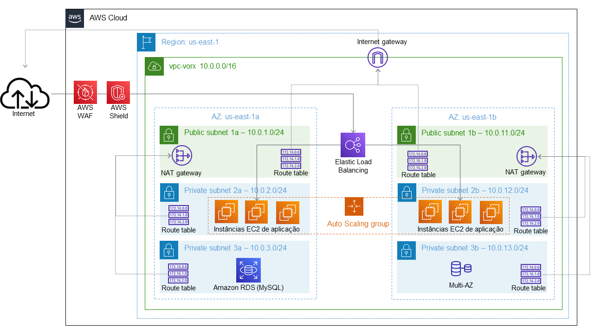

## Cloud Orchestration Tools

Disciplina de Cloud Orchestration Tools

[](https://aws.amazon.com/pt/) [](https://www.terraform.io/) [](https://github.com/) [](https://www.jenkins.io/) [](https://www.docker.com/)

---

#### Projeto da Disciplina

O objetivo é construir uma infraestrutura de rede AWS, utilizando um servidor de CI/CD e Infraestrutura como Código.

**Desenho de Arquitetura:**


> **Observação:** por simplicidade, o NAT Gateway, ELB, ASG, RDS, AWS Shield e AWS WAF não serão criados.

---

#### Infraestrutura

Arquivos do Terraform para criação da infraestrutura AWS disponíveis em [./infra/](./infra/).

Arquivos para criação do Pipeline Jenkins disponíveis em [./pipeline/](./pipeline/).

---

#### Configuração

Criar o arquivo **Dockerfile** dentro do Docker Conteiner na EC2 para baixar a imagem do Jenkins e instalar o Terraform:

```Docker
FROM jenkins/jenkins
USER root
RUN apt-get update && apt-get install wget -y
### Install Terraform ###
RUN wget --quiet https://releases.hashicorp.com/terraform/1.0.9/terraform_1.0.9_linux_amd64.zip \
&& unzip terraform_1.0.9_linux_amd64.zip \
&& mv terraform /usr/bin \
&& rm terraform_1.0.9_linux_amd64.zip
USER jenkins
```

Comando para obter o initial password do Jenkins
```Docker
docker exec -ti jenkins-pod cat /var/jenkins_home/secrets/initialAdminPassword
```

Comando para criar o container do jenkins, mapeando a porta 80 da instancia para 8080 do container:
```Docker
docker run -d -p 80:8080 --name jenkins-container jenkins-server
```

Comando para buildar uma imagem utilizando o Dockerfile (**ATENÇÃO:** o ponto faz parte do comando a seguir, indica o diretório local):
```Docker
docker build -t jenkins-server .
```

Acessar o Jenkins via porta 80 e configurar a pipeline substituindo o parâmetro `seu-git-repo` pelo link SSH do seu repositório no Github:

```yaml
pipeline {
agent any
  stages {
    stage('Clone') {
      steps {
        git url: 'seu-git-repo', branch: 'main'
      }
    }

    stage('TF Init&Plan') {
      steps {
        script {
          sh 'terraform init'
          sh 'terraform plan -out=myplan.out'
        }
      }
    }

    stage('Approval') {
      steps {
        script {
          def userInput = input(id: 'confirm', message: 'Deseja realizar um ' + params.TF_OPTION +  ' na Infraestrutura?', parameters: [ [$class: 'BooleanParameterDefinition', defaultValue: false, description: 'Acao ' + params.TF_OPTION + ' Terraform', name: 'confirm'] ])
        }
      }
    }

    stage('TF Apply') {
      steps {
          sh 'terraform apply myplan.out'
      }
    }
  }
}
```

---

#### Repositórios entregues na avaliação

[vorx-network](https://github.com/Gustavo-RibMartins/vorx-network)
[jenkins-iac](https://github.com/Gustavo-RibMartins/jenkins-iac)